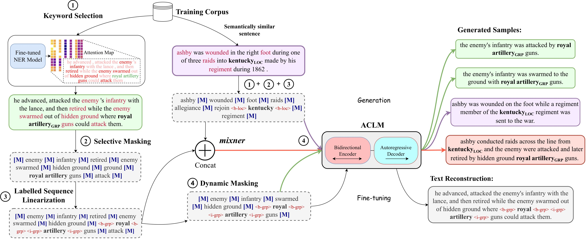

## ACLM : Attention-map aware keyword selection for Conditional Language Model fine-tuning

Implementation of [ACLM: A Selective-Denoising based Generative Data Augmentation Approach for Low-Resource Complex NER](https://arxiv.org/abs/2306.00928)



**Steps:**

1. Install dependencies using:
      ```
      pip install -r requirements.txt
      ```

2. Go to the root folder
      ```
      cd ./src
      ```

3. Run the required sh files
      ```
      sh train_dynamic_multilingual.sh <language> <language label> <size of dataset> <flair batch size> <seed> <masking rate> <number of generations>
      ```
      For _mixner_:
      ```
      sh train_dynamic_multilingual_mixner.sh <language> <language label> <size of dataset> <flair batch size> <seed> <masking rate> <number of generations>
      ```
      Example:
      ```
      sh train_dynamic_multilingual.sh zh zh_CN 100 8 42 0.3 5
      ```
      ```
      sh train_dynamic_multilingual_mixner.sh zh zh_CN 100 8 42 0.3 5
      ```
---
**Please cite our work:**
```
@inproceedings{ghosh-etal-2023-aclm,
    title = "{ACLM}: A Selective-Denoising based Generative Data Augmentation Approach for Low-Resource Complex {NER}",
    author = "Ghosh, Sreyan  and
      Tyagi, Utkarsh  and
      Suri, Manan  and
      Kumar, Sonal  and
      S, Ramaneswaran  and
      Manocha, Dinesh",
    booktitle = "Proceedings of the 61st Annual Meeting of the Association for Computational Linguistics (Volume 1: Long Papers)",
    month = jul,
    year = "2023",
    address = "Toronto, Canada",
    publisher = "Association for Computational Linguistics",
    url = "https://aclanthology.org/2023.acl-long.8",
    pages = "104--125",
    abstract = "Complex Named Entity Recognition (NER) is the task of detecting linguistically complex named entities in low-context text. In this paper, we present ACLM Attention-map aware keyword selection for Conditional Language Model fine-tuning), a novel data augmentation approach based on conditional generation, to address the data scarcity problem in low-resource complex NER. ACLM alleviates the context-entity mismatch issue, a problem existing NER data augmentation techniques suffer from and often generates incoherent augmentations by placing complex named entities in the wrong context. ACLM builds on BART and is optimized on a novel text reconstruction or denoising task - we use selective masking (aided by attention maps) to retain the named entities and certain keywords in the input sentence that provide contextually relevant additional knowledge or hints about the named entities. Compared with other data augmentation strategies, ACLM can generate more diverse and coherent augmentations preserving the true word sense of complex entities in the sentence. We demonstrate the effectiveness of ACLM both qualitatively and quantitatively on monolingual, cross-lingual, and multilingual complex NER across various low-resource settings. ACLM outperforms all our neural baselines by a significant margin (1{\%}-36{\%}). In addition, we demonstrate the application of ACLM to other domains that suffer from data scarcity (e.g., biomedical). In practice, ACLM generates more effective and factual augmentations for these domains than prior methods.",
}
```
